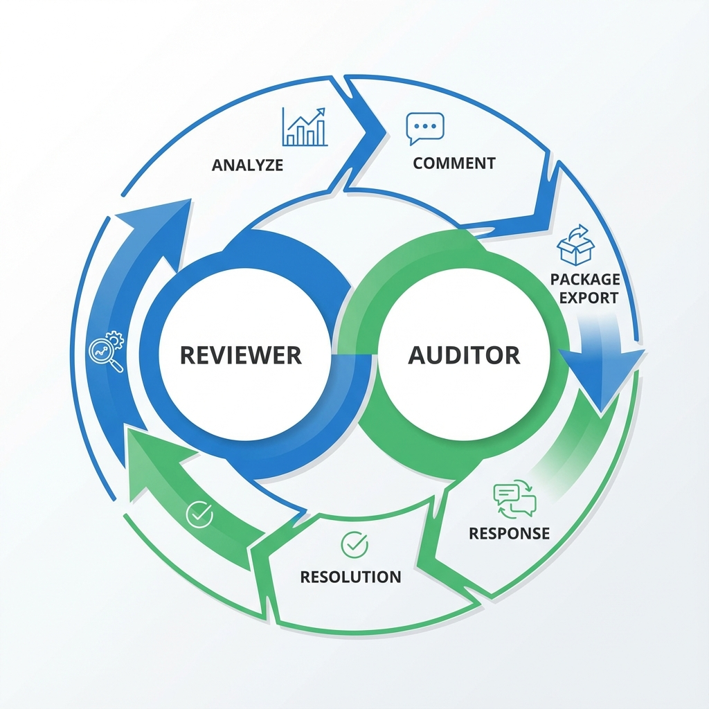

# 🎯 IFS NEO Reviewer - Mode Collaboratif

## À propos du Projet
**IFS NEO Reviewer** est une plateforme web premium conçue pour digitaliser et simplifier la revue des rapports d'audit **IFS Food V8**. Elle permet une collaboration fluide et sécurisée entre le **Reviewer** (chargé de la validation) et l'**Auditeur** (chargé de la saisie sur le terrain).

---

## 🔄 Workflow Collaboratif
L'application repose sur un cycle d'échange de "Packages" (.ifsp) permettant de synchroniser le travail sans connexion internet directe.

1. **Reviewer** : Analyse le fichier NEO (.ifs) et pose des questions ou demande des précisions.
2. **Export IFSP** : Le Reviewer génère un package pour l'auditeur.
3. **Auditeur** : Charge le package, répond aux commentaires, et renvoie son package de réponse.
4. **Reviewer** : Valide les réponses et clôture les points (Statut Résolu).

---

## 🖼️ Visualisations & Modules Détaillés

### 🏢 Profil Entreprise & Synthèse
L'onglet **Profil** constitue le tableau de bord de l'audit. Il regroupe :
- **Informations Générales** : Nom du site, COID, date de l'audit et version du référentiel.
- **Statut de l'Audit** : Visualisation claire des scores, des non-conformités (KOs, Majors) et des points d'attention.
- **Compteurs Dynamiques** : Suivi en temps réel du nombre de questions posées par le reviewer et du nombre de réponses apportées par l'auditeur.

### 📝 Checklist Complète & Filtrage Avancé
La vue **Checklist** permet une navigation granulaire dans les exigences (plus de 200 points de contrôle) :
- **Code Couleur par Chapitre** : Navigation facilitée par des indicateurs visuels de section.
- **Filtres Intelligents** : Affichez uniquement les lignes contenant des commentaires pour vous concentrer sur les points d'échange.
- **Indicateurs de Statut** : Chaque ligne affiche une pastille de couleur (Orange/Vert/Gris) indiquant immédiatement si une action est attendue.

### 💬 Messagerie Contextuelle & Pièces Jointes
Chaque exigence dispose d'un module de chat dédié :
- **Historique Timeline** : Cliquez sur l'icône "œil" pour voir la chronologie des modifications (création, édition, suppression).
- **Gestion des Fichiers (Maj NEO)** : L'auditeur peut signaler une correction faite dans le logiciel NEO et **joindre le nouveau fichier d'audit** directement dans la conversation. Le reviewer peut alors le télécharger en un clic.
- **Preuves Visuelles** : Support pour l'insertion d'images et de captures d'écran pour illustrer les écarts ou les corrections.

### 📁 Revue du Dossier (Nouveau)
Un espace dédié pour la revue des documents annexes est désormais disponible pour le Reviewer :
- **Documents Couverts** : Plan d'audit, Mandat, Contrat, Qualification auditeur, etc.
- **Interaction** : Le Reviewer peut initier des demandes de précisions sur ces documents spécifiques.
- **Vue Auditeur** : L'auditeur ne voit pas cet onglet globalement, mais reçoit les questions directement dans sa liste "Mes Tâches" pour y répondre point par point.

#### 🎨 Standards de Design & Logique UI
Pour maintenir l'aspect "Premium" de ce module, les principes suivants doivent être respectés :
- **Boutons de Validation (Pellicules)** : Utilisation de boutons larges et arrondis avec retour d'état immédiat (Vert Émeraude pour VALIDE, Rouge Corail pour ÉCART, Gris Ardoise pour N/A).
- **Cartes Minimalistes** : Sections séparées par des cartes avec bordure gauche dynamique (Vert si la catégorie est complète, Gris sinon).
- **Logique "À traiter"** : Un point est considéré comme "à traiter" (compteur orange) tant qu'il n'a reçu aucune validation de statut. Dès qu'un bouton de couleur est cliqué, l'élément sort de la liste des tâches restantes.
- **Navigation par Onglets** : Filtres horizontaux épurés avec barre de soulignement pour l'état actif, évitant les menus déroulants encombrants.

### ⚖️ Décision de Certification (Reviewer Exclusif)
Un module final pour acter la conclusion de l'audit :
- **Saisie Complète** : Date de décision, Responsable, Résultat (Base/Supérieur/Échec) et Synthèse globale.
- **Confidentialité** : Cet onglet et ses données sont strictement réservés au Reviewer et n'apparaissent pas sur l'interface de l'auditeur.
- **Rapport Intégré** : Toutes ces informations sont automatiquement incluses en tête du rapport Excel généré.

---

## ⚙️ Administration & Sécurité

### 🛡️ Double Mode Sécurisé
Basculez entre les interfaces selon votre rôle via le toggle en haut de la barre latérale. Chaque mode est protégé par un code d'accès crypté :
- **Mode Reviewer** (Interface Bleue) : `CDOECO2025`
- **Mode Auditeur** (Interface Verte) : `moldu2025`

### 📊 Pilotage par la Légende
Une barre de légende est disponible en haut de l'écran pour rappeler les codes couleurs des pastilles :
- 🟠 **En attente** : Action requise (ex: l'auditeur doit répondre ou le reviewer doit valider).
- 🟢 **Résolu** : Point clarifié, corrigé dans NEO et validé.
- 🔵 **Lu / Info** : Simple partage d'information, pas d'action bloquante.

### 🗑️ Réinitialisation de Sécurité (Cache)
Pour passer d'un dossier client à un autre en toute sécurité, utilisez le bouton **"Réinitialiser l'app"** en bas du menu.
- **Sécurité Anti-Erreur** : Vous devez taper manuellement le mot **SUPPRIMER** pour activer l'effacement définitif.
- **Nettoyage Complet** : Cette action vide la base de données locale (IndexedDB) et le stockage du navigateur afin d'éviter tout mélange de données entre deux audits.

---

## 🚀 Démarrage Rapide

1. **Lancez l'application** : Ouvrez `index.html` dans Chrome ou Edge.
2. **Identifiez-vous** : Choisissez votre mode et entrez votre code.
3. **Chargez vos données** :
   - Utilisez un fichier `.ifs` (Export NEO direct).
   - Ou chargez un `.ifsp` (Package collaboratif reçu).
4. **Collaborez** : Cliquez sur n'importe quelle ligne pour discuter ou joindre des fichiers.
5. **Sauvegardez** : Utilisez "Sauvegarder IFSR" pour garder votre progression localement.

---

## 🛠️ Support et Améliorations
Ce projet évolue grâce à vos retours. Utilisez l'onglet **Issues** sur GitHub pour :
- Signaler un dysfonctionnement.
- Proposer une nouvelle visualisation ou fonctionnalité.
- Partager vos suggestions d'ergonomie.

---
*Développé pour l'excellence opérationnelle des audits IFS.*
